To run this example, please use aact to launch.

```bash
aact run-dataflow examples/experimental/sotopia_original_replica/origin.toml
```

To view the flow of the information, please run:

```bash
aact draw-dataflow examples/experimental/sotopia_original_replica/origin.toml --svg-path examples/experimental/sotopia_original_replica/origin.svg
```


