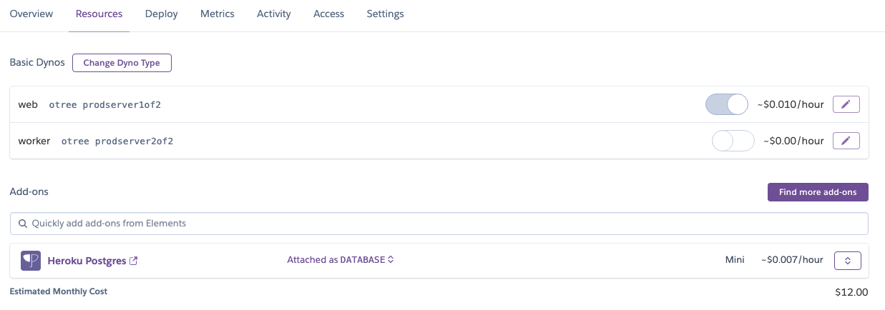
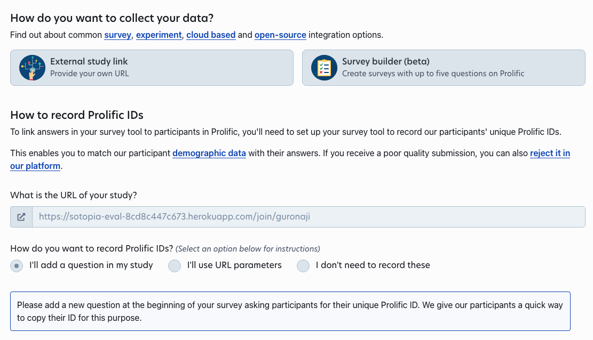

# Human Evaluation for Sotopia Social Conversation

To conduct highly customized human evaluation experiments for Sotopia-$\pi$, we utilize **Prolific** platform to get high-quality annotators and utilize **oTree** to build the full-stack evaluation system.

## File Structure

The overall structure of this provided human evaluation system includes two parts: `pilot_study` and `official_study`. For `pilot_study`, it is used to select qualified annotators from the prolific. For `official_study`, it is used to get the final human evaluation results based on qualified annotators.

The important files for the otree project is described as:

```
human_eval/
├─ official_study_payment_info/ # for annotator payment checking page
│   ─ __init__.py # payment information
│   ─ PaymentInfo.html # payment HTML page
├─ pilot_study_payment_info/ # for annotator payment checking page
│   ─ __init__.py # payment information
│   ─ PaymentInfo.html # payment HTML page
├─ sotopia_official_study/ # for annotator instruction and answering pages
│   ─ __init__.py # data point distribution logic and data processing logic
│   ─ SotopiaEval.html # annotator filling answer page
│   ─ SotopiaEvalInstruction.html # annotator task instruction page
├─ sotopia_pilot_study/ # for annotator instruction and answering pages
    ─ __init__.py # data point distribution logic and data processing logic
    ─ SotopiaEval.html # annotator filling answer page
    ─ SotopiaEvalInstruction.html # annotator task instruction page
...
```

## Local Machine Development

We can locally launch our otree project based on the following command:

```bash
pip install -r requirements.txt
otree devserver
```

After this operation, we can visit the website via https://localhost:8000 for debugging.

## Project Deployment

#### Step1. Create Apps on Heruko

**Step1.1**

First, we need to create a Heruko apps as our base app to deploy.

**Step1.2**

Secondly, we need to link our apps with Heroku Postgres.



**Step1.3**

Thirdly, we need to change the environment config var under setting to support release of our evaluation task including avoiding debugging information and admin login.


### Step2. Deploy oTree project via oTree Hub

**Step2.1**

After finishing modifying the otree project, we can run `otree zip` to have a `otree_project.otreezip` for deployment.

**Step2.2**

Secondly, this zip file is used to deploy on oTree Hub. Each oTree Hub should be linked with one or more Heruko apps so that we can directly deploy based on that. (https://www.otreehub.com/my_projects/). More instructions about how to use otree-hub can be found at https://otree.readthedocs.io/en/latest/server/heroku.html.


**Step2.3**

Thirdly, after deploying on oTree Hub, we need to reset our database to make sure our database is empty (which is optional but recommended).

**Step2.4**

Finally, we can get a deployment link similar with https://sotopia-eval-8cd8c447c673.herokuapp.com/demo that is deployed on Heruko server.

### Step3. Release on Prolific

**Step3.1**

To release on Prolific, we need to get a release link that annotators can directly access to. To get this release link, we need to click into the deployment link and create new sessions with sufficient participants. Therefore, we can get a session-wide link that is used for annotators like https://sotopia-eval-8cd8c447c673.herokuapp.com/join/tikanoma.


**Step3.2**

Secondly, we just put the release link into the Prolific project setting.


